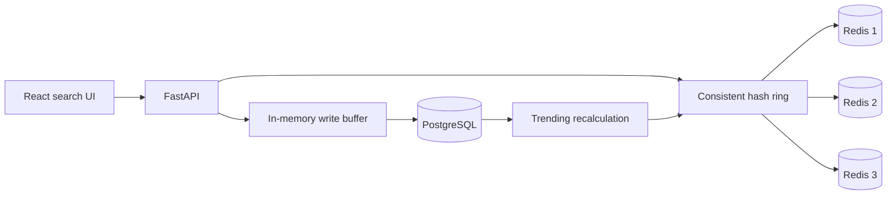

# Typeahead System

A full-stack search-suggestion prototype built to explore typeahead system
design: exact-prefix lookup, consistent-hash cache sharding, batched writes, and
time-decayed trending scores.

## Architecture



## How requests are handled

- `GET /suggest?q=pre` hashes the normalized prefix to one Redis node.
- A cache miss queries PostgreSQL, ranks up to 50 matches, returns the top 10,
  and stores them in Redis for one hour.
- `POST /search?q=query` records the search in an in-memory buffer and updates
  every prefix asynchronously.
- Buffered counts flush to PostgreSQL every five seconds or after 100 pending
  searches.
- Global trending results are recalculated every 30 seconds with a decaying
  score based on count and age.

## Stack

| Layer | Technology |
|---|---|
| Frontend | React 19 and Vite |
| API | FastAPI and Uvicorn |
| Durable store | PostgreSQL with SQLAlchemy async |
| Cache | Three Redis nodes |
| Sharding | MD5 consistent-hash ring with virtual nodes |

## Local setup

Requirements: Python 3.10 or newer, Node.js, and Docker.

```bash
git clone https://github.com/Raghavendra1729-cell/Typeahead-System.git
cd Typeahead-System/Backend
docker compose up -d
```

### Current configuration note

This repository is a system-design prototype. Database and Redis connection
strings are currently defined directly in `Backend/app/core/database.py`, while
the checked-in Docker Compose file uses a different PostgreSQL username,
password, and database name. Align those values before starting the API. The
`.env.example` file documents the intended local endpoints but is not yet read
by the database module.

Once the connection settings agree:

```bash
cd Backend
python3 -m venv .venv
source .venv/bin/activate
pip install -r requirements.txt
uvicorn app.main:app --reload
```

Optionally seed sample query data:

```bash
python3 seed_data.py
```

Start the frontend in a second terminal:

```bash
cd Frontend
npm install
npm run dev
```

## API

| Method | Path | Purpose |
|---|---|---|
| `GET` | `/suggest?q=prefix` | Return up to 10 ranked prefix matches |
| `POST` | `/search?q=query` | Record a search and refresh prefix scores |
| `GET` | `/trending` | Return the global top 10 |
| `GET` | `/cache/debug?prefix=x` | Show the Redis node for a prefix |

## Project structure

```text
.
├── Backend/
│   ├── app/api/            # Suggest, search, trending, and debug routes
│   ├── app/core/           # Database, cache ring, and scoring
│   ├── app/services/       # Batched persistence and cache updates
│   ├── docker-compose.yml  # PostgreSQL and three Redis nodes
│   └── seed_data.py
└── Frontend/
    └── src/                # React search interface
```

## Current scope

The prototype demonstrates the data flow but is not production-ready. It lacks
authentication, rate limiting, migrations, automated tests, failure recovery,
and deployable environment-based connection configuration.
